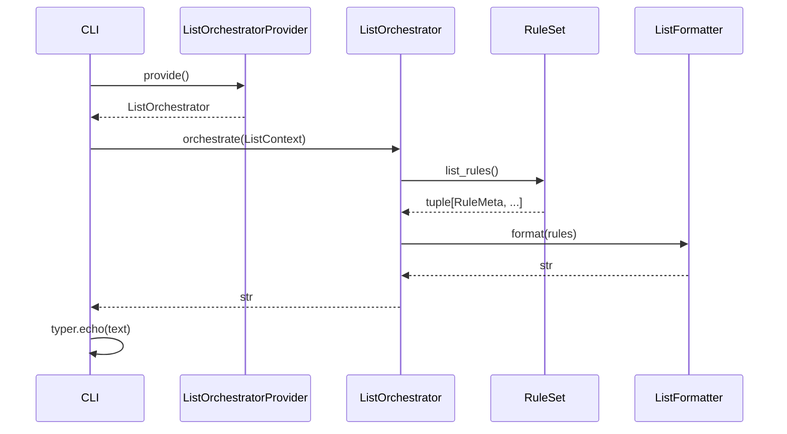

# list モジュール 設計書

> 要件定義書: [requirements.md](./requirements.md)

## 1. 設計の目的と背景

### システム構成

`paladin list` コマンドの実行フローを担うモジュール。CLI から `ListContext` を受け取り、`ListOrchestrator` がルール一覧の取得とテキスト整形を制御し、整形済み文字列を CLI に返す。CLI 層はその文字列を標準出力に表示する。

依存するルール情報は `paladin.rule` モジュールの `RuleSet` を通じて取得する。`list` モジュール自身はルール管理の責務を持たず、取得したメタ情報の整形のみを担う。

### 設計方針

- Orchestrator パターンで処理フロー全体を一箇所に集約し、可読性と変更容易性を確保する
- Provider パターンで依存オブジェクトの生成を Composition Root に集約し、Orchestrator をテスト容易な純粋クラスに保つ
- コンテキストオブジェクト（`ListContext`）を CLI との境界として利用し、将来のオプション追加に対応できるようにする

## 2. 設計の全体像

### 2.1 アーキテクチャパターン

- **Orchestrator パターン**: 処理フローの制御を `ListOrchestrator` に集約
- **Provider パターン（Composition Root）**: 依存オブジェクトの生成を `ListOrchestratorProvider` に集約
- **コンテキストオブジェクト**: CLI と Orchestrator の境界を `ListContext` で定義

### 2.2 外部システム依存

| 依存先 | 用途 |
|---|---|
| `paladin.rule.RuleSet` | ルールメタ情報の取得（`list_rules()`） |
| `paladin.rule.RuleMeta` | ルール表示データの型 |
| `paladin.foundation.log` | `@log` デコレータによる処理ログ |

### 2.3 主要コンポーネント

| コンポーネント | 責務 |
|---|---|
| `ListContext` | CLI から受け取る実行時パラメータを保持する不変オブジェクト |
| `ListOrchestrator` | ルール一覧の取得と整形を制御する処理フロー管理 |
| `ListFormatter` | `tuple[RuleMeta, ...]` を整列されたテキストに変換する整形担当 |
| `ListOrchestratorProvider` | `ListOrchestrator` とその依存をインスタンス化する Composition Root |

### 2.4 処理フロー概略

1. CLI が `ListContext` を生成し `ListOrchestrator.orchestrate()` を呼び出す
2. `ListOrchestrator` が `RuleSet.list_rules()` でルールメタ情報を取得する
3. `ListFormatter.format()` がメタ情報を整列テキストに変換する
4. CLI が受け取った文字列を標準出力に表示する

## 3. 重要な設計判断

### 3.1 `ListContext` を空フィールドで定義する理由

現時点では `paladin list` にオプションは存在しないが、他のサブコマンド（`check` 等）と同じく `ListContext` を CLI 境界として定義している。

将来 `--format json` 等のオプションを追加する場合、CLI 側と Orchestrator 側の変更がコンテキストフィールドの追加に留まり、インターフェースを壊さずに拡張できる。`Context` オブジェクトなしで直接引数を渡す設計では、オプション追加のたびに `orchestrate()` のシグネチャが変わりやすい。

### 3.2 整形責務を `ListFormatter` に分離する理由

整形ロジックを `ListOrchestrator` に直接書く設計と比較したとき、`ListFormatter` への分離には以下の利点がある。

- Orchestrator は処理フローの制御に専念でき、整形仕様の変更が Orchestrator に影響しない
- 将来 JSON 形式など別の出力形式を追加する場合、`ListFormatterFactory` パターンへ拡張しやすい（`check` モジュールで実績あり）

トレードオフとして、クラス数が増えるが、各クラスの責務が単純になるため保守コストは低い。

### 3.3 `RuleSet` を直接 Orchestrator に注入する理由

`list` モジュールの関心はルールの管理ではなく一覧表示のみである。ルール管理の責務は `paladin.rule.RuleSet` が持つ設計になっているため、`list` モジュールが `RuleSet` を介してのみルール情報を取得することで、モジュール間の関心が明確に分離される。

## 4. アーキテクチャ概要

### 4.1 レイヤー構造とファイルレイアウト

```mermaid
flowchart TD
    CLI["CLI (cli.py)"]
    Provider["ListOrchestratorProvider\n(provider.py)\nComposition Root"]
    Orchestrator["ListOrchestrator\n(orchestrator.py)\n処理フロー制御"]
    RuleSet["RuleSet\n(paladin.rule)"]
    Formatter["ListFormatter\n(formatter.py)"]

    CLI -->|ListContext| Provider
    Provider -->|生成・注入| Orchestrator
    Orchestrator -->|list_rules()| RuleSet
    Orchestrator -->|format()| Formatter
```

ファイルレイアウト:

```
src/paladin/list/
    __init__.py      # 公開 API (ListContext / ListOrchestrator / ListOrchestratorProvider)
    context.py       # ListContext: 実行時パラメータの不変オブジェクト
    formatter.py     # ListFormatter: テキスト整形
    orchestrator.py  # ListOrchestrator: 処理フロー制御
    provider.py      # ListOrchestratorProvider: Composition Root
```

### 4.2 処理フロー



## 5. 重要な制約と注意点

### 5.1 公開 API の範囲

`paladin.list` の `__all__` に定義された `ListContext`・`ListOrchestrator`・`ListOrchestratorProvider` のみが互換性保証の対象。内部モジュール（`formatter.py` 等）は直接 import しない。

### 5.2 ルール登録順序への依存

`ListFormatter` が出力するルールの順序は `RuleSet` に登録された順序に依存する。ソートや並び替えの責務は `list` モジュールではなく `RuleSet` 側が持つ。

## 6. 将来の拡張性

### 想定される拡張ポイント

- `--format json` オプション追加: `ListContext` にフォーマット種別フィールドを追加し、`ListFormatterFactory` を導入する（`check` モジュールの `CheckFormatterFactory` が参考実装）
- フィルタリング: `ListContext` にフィルタ条件を追加し、`ListOrchestrator.orchestrate()` 内でフィルタ処理を追加する

### 拡張時の注意点

- `ListFormatter` の整形仕様を変更する場合、列幅の計算ロジック（最大長ベースのパディング）は `formatter.py` に閉じているため、影響範囲が限定される
- 新しいフォーマットを追加する場合は既存の `ListFormatter` を変更せず、新しいクラスを追加して `Provider` で切り替える設計を推奨する

## 7. 関連ドキュメント

- [requirements.md](./requirements.md): list モジュール要件定義書
